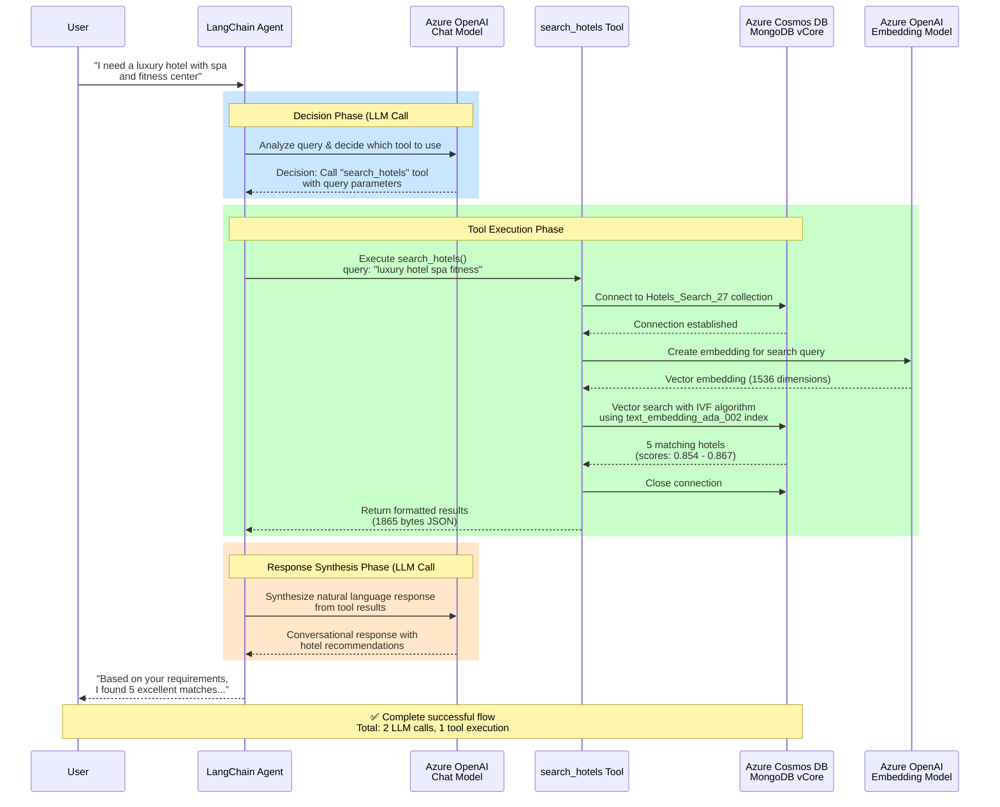
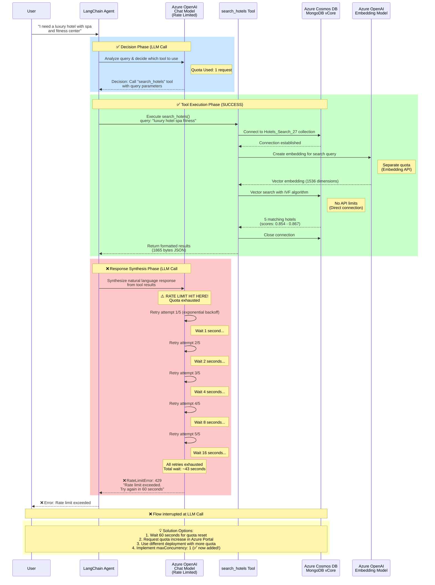

# LangChain Agent Flow Architecture

This document visualizes how the LangChain agent processes queries through Azure services, including where rate limits occur.

## Diagram 1: Successful Agent Flow

This diagram shows the complete, successful execution path when quota is available.



### Flow Breakdown

#### Phase 1: Decision Phase (LLM Call #1) 🔵
1. User sends natural language query
2. Agent forwards to Azure OpenAI Chat Model
3. LLM analyzes query and decides to call `search_hotels` tool
4. Returns tool name and parameters to agent

**Azure Service:** Azure OpenAI (Chat Completions API)  
**Cost:** ~1 request against quota  
**Duration:** ~1-2 seconds

#### Phase 2: Tool Execution Phase 🟢
1. Agent invokes `search_hotels` tool with parameters
2. Tool connects to Azure Cosmos DB MongoDB vCore
3. Tool requests embedding from Azure OpenAI Embedding API
4. Tool performs vector search using IVF algorithm
5. MongoDB returns 5 matching hotels with similarity scores
6. Tool formats results and returns to agent

**Azure Services:**
- Azure Cosmos DB MongoDB vCore (no API quota limits)
- Azure OpenAI Embedding API (separate quota from Chat)

**Cost:** 1 embedding request  
**Duration:** ~2-3 seconds

#### Phase 3: Response Synthesis Phase (LLM Call #2) 🟠
1. Agent sends tool results back to LLM
2. LLM synthesizes natural language response
3. Agent returns formatted response to user

**Azure Service:** Azure OpenAI (Chat Completions API)  
**Cost:** ~1 request against quota  
**Duration:** ~1-2 seconds

---

## Diagram 2: Rate Limit Failure Flow

This diagram shows what happens when Azure OpenAI quota is exhausted.



### Rate Limit Analysis

#### What Succeeded ✅
1. **LLM Call #1**: Agent successfully analyzed query and decided on tool
2. **MongoDB Connection**: Successfully connected to Cosmos DB
3. **Embedding API**: Successfully created query embedding
4. **Vector Search**: Successfully found 5 matching hotels
5. **Tool Response**: Successfully returned formatted results to agent

#### What Failed ❌
1. **LLM Call #2**: Hit rate limit when trying to synthesize response
2. **Retry Logic**: All 5 retry attempts exhausted over 43 seconds
3. **Final Response**: User never received the final answer

#### Why This Happens

**Azure OpenAI Rate Limits:**
- **Requests per minute (RPM)**: Limited by deployment quota
- **Tokens per minute (TPM)**: Limited by deployment quota
- **Concurrent requests**: Can overwhelm quota quickly

**In this scenario:**
1. First LLM call succeeded (quota available)
2. Tool execution took ~2-3 seconds
3. Second LLM call hit exhausted quota
4. Exponential backoff retries all failed (quota not reset in 43s)
5. Azure requires 60 second wait for quota reset

#### Key Observations

1. **MongoDB is NOT the problem**: All database operations succeeded
2. **Your code is correct**: The tool executed perfectly
3. **Rate limit is external**: Azure OpenAI API quota limits
4. **Timing matters**: If quota resets between calls, no error occurs

### Solutions Implemented

✅ **Added `maxConcurrency: 1`** to chat client configuration:
```typescript
const chatClient = new AzureChatOpenAI({
    // ... other config
    maxConcurrency: 1,  // Prevents multiple concurrent requests
});
```

This prevents multiple agent queries from running simultaneously and overwhelming quota.

### Additional Recommendations

See `RATE-LIMIT-HANDLING.md` for:
- Fallback model configuration
- Circuit breaker pattern
- Request queueing for production
- Quota monitoring strategies

---

## Azure Services Overview

| Service | Purpose | Quota Type | In Your Flow |
|---------|---------|------------|--------------|
| **Azure OpenAI (Chat)** | LLM decision making & response synthesis | API Quota (RPM/TPM) | 2 calls per agent query |
| **Azure OpenAI (Embedding)** | Convert text to vectors | API Quota (Separate) | 1 call per search |
| **Azure Cosmos DB MongoDB vCore** | Vector database storage & search | No API limits | Direct connection |

## Key Takeaways

1. ✅ **Your MongoDB integration works perfectly**
2. ✅ **Document conversion utilities work correctly**
3. ✅ **Tool execution completes successfully**
4. ❌ **Rate limit occurs on Azure OpenAI API** (external to your code)
5. 💡 **Solution**: Request quota increase or wait between queries

The rate limit is **not a code bug** - it's an expected behavior when API quota is exhausted.
