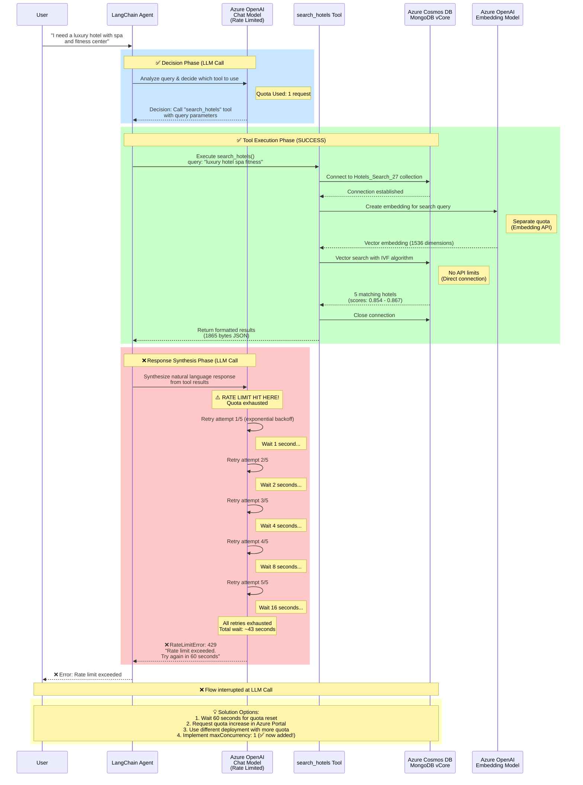

```mermaid
sequenceDiagram
    participant User
    participant Agent as LangChain Agent
    participant LLM as Azure OpenAI<br/>Chat Model<br/>(Rate Limited)
    participant Tool as search_hotels Tool
    participant MongoDB as Azure Cosmos DB<br/>MongoDB vCore
    participant Embedding as Azure OpenAI<br/>Embedding Model

    User->>Agent: "I need a luxury hotel with spa<br/>and fitness center"
    
    rect rgb(200, 230, 255)
        Note over Agent,LLM: ✅ Decision Phase (LLM Call #1 - SUCCESS)
        Agent->>LLM: Analyze query & decide which tool to use
        Note right of LLM: Quota Used: 1 request
        LLM-->>Agent: Decision: Call "search_hotels" tool<br/>with query parameters
    end

    rect rgb(200, 255, 200)
        Note over Agent,MongoDB: ✅ Tool Execution Phase (SUCCESS)
        Agent->>Tool: Execute search_hotels()<br/>query: "luxury hotel spa fitness"
        
        Tool->>MongoDB: Connect to Hotels_Search_27 collection
        MongoDB-->>Tool: Connection established
        
        Tool->>Embedding: Create embedding for search query
        Note right of Embedding: Separate quota<br/>(Embedding API)
        Embedding-->>Tool: Vector embedding (1536 dimensions)
        
        Tool->>MongoDB: Vector search with IVF algorithm
        Note right of MongoDB: No API limits<br/>(Direct connection)
        MongoDB-->>Tool: 5 matching hotels<br/>(scores: 0.854 - 0.867)
        
        Tool->>MongoDB: Close connection
        Tool-->>Agent: Return formatted results<br/>(1865 bytes JSON)
    end

    rect rgb(255, 200, 200)
        Note over Agent,LLM: ❌ Response Synthesis Phase (LLM Call #2 - FAILED)
        Agent->>LLM: Synthesize natural language response<br/>from tool results
        
        Note over LLM: ⚠️ RATE LIMIT HIT HERE!<br/>Quota exhausted
        
        LLM->>LLM: Retry attempt 1/5 (exponential backoff)
        Note right of LLM: Wait 1 second...
        
        LLM->>LLM: Retry attempt 2/5
        Note right of LLM: Wait 2 seconds...
        
        LLM->>LLM: Retry attempt 3/5
        Note right of LLM: Wait 4 seconds...
        
        LLM->>LLM: Retry attempt 4/5
        Note right of LLM: Wait 8 seconds...
        
        LLM->>LLM: Retry attempt 5/5
        Note right of LLM: Wait 16 seconds...
        
        Note over LLM: All retries exhausted<br/>Total wait: ~43 seconds
        
        LLM-->>Agent: ❌ RateLimitError: 429<br/>"Rate limit exceeded.<br/>Try again in 60 seconds"
    end

    Agent-->>User: ❌ Error: Rate limit exceeded

    Note over User,MongoDB: ❌ Flow interrupted at LLM Call #2<br/>✅ MongoDB operations succeeded<br/>❌ Final response synthesis failed

    rect rgb(255, 255, 200)
        Note over User,MongoDB: 💡 Solution Options:<br/>1. Wait 60 seconds for quota reset<br/>2. Request quota increase in Azure Portal<br/>3. Use different deployment with more quota<br/>4. Implement maxConcurrency: 1 (✅ now added!)
    end
```
