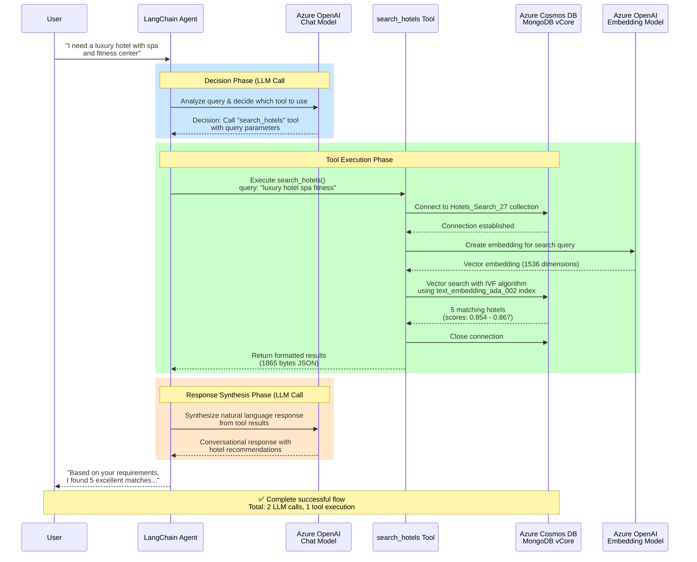

```mermaid
sequenceDiagram
    participant User
    participant Agent as LangChain Agent
    participant LLM as Azure OpenAI<br/>Chat Model
    participant Tool as search_hotels Tool
    participant MongoDB as Azure Cosmos DB<br/>MongoDB vCore
    participant Embedding as Azure OpenAI<br/>Embedding Model

    User->>Agent: "I need a luxury hotel with spa<br/>and fitness center"
    
    rect rgb(200, 230, 255)
        Note over Agent,LLM: Decision Phase (LLM Call #1)
        Agent->>LLM: Analyze query & decide which tool to use
        LLM-->>Agent: Decision: Call "search_hotels" tool<br/>with query parameters
    end

    rect rgb(200, 255, 200)
        Note over Agent,MongoDB: Tool Execution Phase
        Agent->>Tool: Execute search_hotels()<br/>query: "luxury hotel spa fitness"
        
        Tool->>MongoDB: Connect to Hotels_Search_27 collection
        MongoDB-->>Tool: Connection established
        
        Tool->>Embedding: Create embedding for search query
        Embedding-->>Tool: Vector embedding (1536 dimensions)
        
        Tool->>MongoDB: Vector search with IVF algorithm<br/>using text_embedding_ada_002 index
        MongoDB-->>Tool: 5 matching hotels<br/>(scores: 0.854 - 0.867)
        
        Tool->>MongoDB: Close connection
        Tool-->>Agent: Return formatted results<br/>(1865 bytes JSON)
    end

    rect rgb(255, 230, 200)
        Note over Agent,LLM: Response Synthesis Phase (LLM Call #2)
        Agent->>LLM: Synthesize natural language response<br/>from tool results
        LLM-->>Agent: Conversational response with<br/>hotel recommendations
    end

    Agent-->>User: "Based on your requirements,<br/>I found 5 excellent matches..."

    Note over User,MongoDB: ✅ Complete successful flow<br/>Total: 2 LLM calls, 1 tool execution
```
